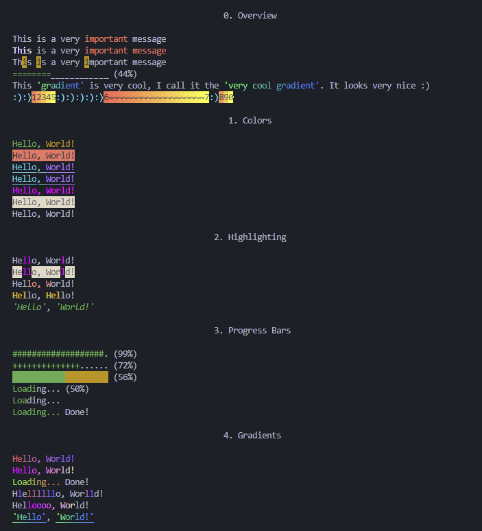

# console_color
Is a very simple python library for changing text color with ANSI escape codes.

All of the code below can be found in the [examples](examples.py) script. Output of the examples script:



## Overwiew
```python
print("This is a very", red("important"), "message")
print(color(bold, "This", reset, "is a very", red, "important", "message"))
print(highlight("This is a very important message", "i", colors=[bg_yellow]))
print()
print(progress_bar(0.444, 20, char="=", char2="_"))
gradient_very_cool = gradient_rgb((0, 255, 100), (0, 100, 255))
print(highlight_between("This 'gradient' is very cool, I call it the 'very cool gradient'. It looks very nice :)", "'", "'", colors=[gradient_very_cool]))
bg_gradient_very_cool = bg_gradient(bg_b_red, bg_b_yellow)
print(highlight(":):)12345:):):):):)6~~~~~~~~~~~~~~~~~~~~7:)890", ":)", colors=[rgb(hex2rgb("00EEFE"))], colors2=[bg_gradient_very_cool]))
```

## 1. Colors
```python
print(green("Hello,"), yellow("World!"))
print(bg_red("Hello,", escape=False), "World!" + reset()) # Background will bleed into the next word
# This looks really complicated vvv
print(underline(cyan("Hello,", escape=False) + " " + magenta("World!")))
# But it can be simplified with the `color` function
print(color(underline, cyan, "Hello,", magenta, "World!"))
# You can also use 24-bit rgb colors
fuchsia = rgb((255, 0, 255))
print(fuchsia("Hello, World!"))
# Same with background colors
bg_bone = bg_rgb(hex2rgb("#E3DAC9"))
x = bg_bone("Hello, World!")
print(x)
# You can also uncolor stuff
print(uncolor(x))
```

## 2. Highlighting
```python
print(highlight("Hello, World!", "l", colors=[fuchsia]))
# You can also highlight the unhighlighted
print(highlight("Hello, World!", "l", colors=[fuchsia], colors2=[bg_bone]))
# Or in an index range
print(highlight_range("Hello, World!", 3, 8, colors=[b_red]))
# Or between two two substring
print(highlight_between("Hello, Hello!", "H", "l", colors=[yellow, bold]))
# Or like this
print(highlight_between("'Hello', 'World!'", "'", "'", colors=[green, italic]))
```

## 3. Progress Bar
```python
print()
print(progress_bar(0.33, 20))
print(progress_bar(0.66, 20))
print(progress_bar(0.99, 20))
print()
# They get printed on top of the last line
# You can change the chars of the loaded and yet to be loaded parts
print(progress_bar(0.72, 20, char="+", char2="."))
print()
# Or make them flat rectangles
print(progress_bar(0.57, 20, char=" ", char2=" ", colors=[bg_green], colors2=[bg_yellow]))
print()
# Or a loading message
message = "Loading..."
print(progress_bar(0.5, len(message), char=message, char2=message))
print()
# The width argument accounts only for the bar itself, not the loading percentage
# But you can turn it off
print(progress_bar(0.33, len(message), char=message, char2=message, percentage=False))
print()
# You can also add a on_complete message
print(progress_bar(1.0, len(message), char=message, char2=message, on_complete="Done!"))
```

## 4. Gradients
```python
red_to_blue = gradient(b_red, b_blue)
print(red_to_blue("Hello, World!"))
# Most default, non-bright colors arent too good for making gradients
# You can change it with the approx_colors_set() funciton
# But it's a better idea to use curstom RGB values
gradient_custom = gradient_rgb((255, 0, 255), hex2rgb("#E3DAC9"))
print(gradient_custom("Hello, World!"))
# Only linear gradients are possible as of today
# But you can use them with other functions from this module (except color())
print()
green_to_red = gradient(b_green, b_red)
# The gradient gets streched out when the progress_bar is loaded, I might do something about it later
print(progress_bar(1.0, len(message), colors=[green_to_red], char=message, char2=message, on_complete="Done!"))
print(highlight("Hlellllllo, Worlld!", "l", colors=[red_to_blue]))
print(highlight_range("Helloooo, World!", 3, 13, colors=[gradient_custom]))
gradient_sea = gradient_rgb((0, 255, 100), (0, 100, 255))
# Put the gradients first because they escape every single character and that includes ANSI escape sequences
print(highlight_between("'Hello', 'World!'", "'", "'", colors=[gradient_sea, underline]))
print()
```